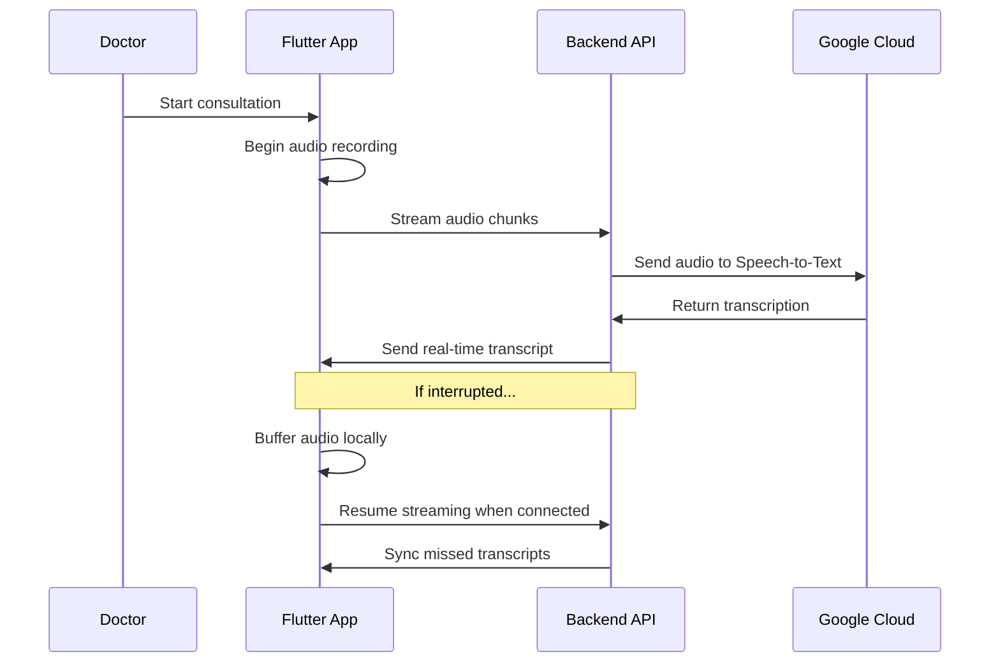

# 🩺 MediNote – Medical Transcription App 

<div align="center">


*A robust Flutter-Node.js medical transcription solution built for real-world healthcare environments*

</div>

---

## 📋 Overview

**MediNote** is a comprehensive medical transcription system consisting of a **Flutter mobile/desktop app** and a **Node.js backend server**. Built as part of an assignment to design a tool that doctors can trust during patient consultations, ensuring no consultation data is ever lost—even in messy, unpredictable conditions.

---

## 📌 The Assignment Challenge

Doctors need an app that can handle **real-world hospital scenarios**:

- 🎙️ **Record audio** of consultations seamlessly
- ☁️ **Stream recordings to backend** for real-time AI transcription
- ⚡ **Work under tough conditions**:
  - Phone calls interrupting mid-recording
  - Switching apps to check drug databases
  - Hospital WiFi dropping out
  - Sudden battery shutdowns at ~60%
  - Network instability and bandwidth limitations

*The goal: make transcription reliable, resilient, and trustworthy for critical medical use.*

---

## 🏗️ System Architecture

```
┌─────────────────┐    📡 Real-time Audio    ┌─────────────────┐
│                 │ ────── Streaming ──────► │                 │
│  Flutter App    │                          │  Node.js API    │
│  (Cross-platform) │                        │  (Backend)      │
│                 │ ◄───── Transcripts ────── │                 │
└─────────────────┘                          └─────────────────┘
         │                                            │
         │                                            │
         ▼                                            ▼
┌─────────────────┐                          ┌─────────────────┐
│  Local Storage  │                          │  Google Cloud   │
│  (SQLite/Hive)  │                          │  (AI Services)  │
└─────────────────┘                          └─────────────────┘
```

---

## 📱 Flutter App Features

### 🎯 Core Functionality
✅ **Secure Authentication** (BLoC pattern + JWT)  
✅ **Patient Management System**  
✅ **Real-time Audio Recording** with interruption handling  
✅ **Background Audio Streaming** to backend  
✅ **Offline-first Architecture** with sync capabilities  
✅ **Cross-platform Support** (Android, iOS, Web, Desktop)  

### 📂 App Structure
```
lib/
├── blocs/              # State management (Auth, Patient, Recording)
│   ├── auth/
│   ├── patient/
│   └── transcription/
├── helpers/            # Reusable widgets & constants
├── models/             # Data models (Doctor, Patient, Transcripts)
├── pages/              # UI Screens
│   ├── auth/
│   ├── home/
│   ├── patients/
│   └── transcripts/
├── services/           # Core business logic
│   ├── auth_service.dart
│   ├── patient_service.dart
│   ├── storage_service.dart
│   └── background_service.dart
└── main.dart           # App entry point
```

---

## 🖥️ Backend Server Features

### ⚙️ Core Services
✅ **RESTful API** with Express.js framework  
✅ **Real-time Audio Processing** via WebSockets  
✅ **Google Cloud Integration** for AI transcription  
✅ **JWT Authentication** middleware  
✅ **Patient Data Management**  
✅ **Session Recording** and transcript storage  
✅ **Docker Containerization** for easy deployment  

### 🗂️ Backend Structure
```
medinote-backend/
├── Dockerfile                          # Container configuration
├── docker-compose.yml                  # Multi-service orchestration
├── server.js                          # Express app entry point
├── package.json                       # Dependencies & scripts
├── asstest-473218-b86a5555bb0b.json  # GCP service account key
├── middleware/
│   └── auth.js                        # JWT authentication middleware
├── models/                            # Database schemas
├── routes/
│   ├── auth.js                        # Authentication endpoints
│   ├── patients.js                    # Patient management API
│   └── sessions.js                    # Recording session API
└── node_modules/                      # Dependencies
```

---

## 🚀 Tech Stack

### Frontend
- **Framework:** Flutter 3.x (Dart)
- **State Management:** BLoC Pattern
- **Local Storage:** SQLite/Hive
- **Audio Recording:** Flutter plugins
- **HTTP Client:** Dio with interceptors

### Backend
- **Runtime:** Node.js
- **Framework:** Express.js
- **Authentication:** JWT
- **Real-time:** Socket.io
- **Cloud Services:** Google Cloud Speech-to-Text
- **Containerization:** Docker + Docker Compose

### Infrastructure
- **Cloud Platform:** Google Cloud Platform
- **AI Services:** Cloud Speech-to-Text API
- **Storage:** Cloud Storage
- **Deployment:** Docker containers

---

## 🔄 How It Works



1. **🔐 Authentication:** Doctor securely logs in
2. **🎙️ Recording:** App starts audio capture with patient consent
3. **📡 Streaming:** Audio chunks sent to backend in real-time
4. **🤖 AI Processing:** Google Cloud converts speech to text
5. **📝 Transcription:** Results streamed back to app
6. **💾 Storage:** Transcripts saved locally and remotely
7. **🔄 Resilience:** Auto-recovery from any interruptions

---

## 🛡️ Resilience Features

### 📱 App-Level Resilience
- **Auto-resume recording** after phone calls
- **Background processing** when app is minimized
- **Local buffering** during network outages
- **Battery optimization** for long consultations
- **Graceful error handling** with user notifications

### 🖥️ Backend Resilience
- **Rate limiting** and request throttling
- **Circuit breakers** for external services
- **Retry mechanisms** with exponential backoff
- **Health check endpoints** for monitoring
- **Horizontal scaling** with load balancing

---

## 🚀 Quick Start

### Prerequisites
- Flutter SDK 3.x+
- Node.js 18+
- Docker & Docker Compose
- Google Cloud account with Speech-to-Text API enabled

### 🏃‍♂️ Running the Backend
```bash
cd medinote-backend
npm install
npm start

# Or with Docker
docker-compose up -d
```

### 📱 Running the Flutter App
```bash
cd medinote-app
flutter pub get
flutter run
```

---

## 🔒 Security & Compliance

- 🛡️ **HIPAA-ready architecture** (encryption in transit & at rest)
- 🔐 **JWT-based authentication** with refresh tokens
- 🔒 **API rate limiting** and DDoS protection
- 📊 **Audit logging** for all patient data access
- 🌐 **HTTPS/WSS only** for all communications

---

## 🧪 Testing Strategy

- **Unit Tests:** Core business logic validation
- **Integration Tests:** API endpoint verification  
- **Widget Tests:** Flutter UI component testing
- **End-to-End Tests:** Full user journey simulation
- **Load Tests:** Backend performance under stress

---

## 📈 Performance Metrics

- **Audio Latency:** < 200ms for real-time streaming
- **Transcription Accuracy:** > 95% for medical terminology
- **Offline Capability:** 24+ hours of local storage
- **Battery Usage:** Optimized for 8+ hour shifts
- **Network Efficiency:** Adaptive bitrate streaming

---

## 🔮 Roadmap & Future Enhancements

### Phase 1 (Current)
- ✅ Core transcription functionality
- ✅ Cross-platform mobile support
- ✅ Basic patient management

### Phase 2 (Next Quarter)
- 🔒 **End-to-end encryption** for patient confidentiality
- 🌐 **Multi-language support** (Spanish, French, etc.)
- 📊 **Analytics dashboard** for doctors
- 🔍 **Medical terminology optimization**

### Phase 3 (Future)
- 🤝 **Multi-doctor collaboration** features
- 🧠 **AI-powered summarization** and keyword extraction
- 📋 **Integration with EHR systems**
- 🎯 **Specialty-specific templates** (Cardiology, Pediatrics, etc.)

---

## 🤝 Contributing

We welcome contributions! Please see our [Contributing Guide](CONTRIBUTING.md) for details.

```bash
# Fork the repository
git clone https://github.com/yourusername/medinote.git
cd medinote

# Create feature branch
git checkout -b feature/amazing-feature

# Make changes and commit
git commit -m "Add amazing feature"

# Push and create PR
git push origin feature/amazing-feature
```

---

## 📜 License

This project is licensed under the MIT License - see the [LICENSE](LICENSE) file for details.

---

## 👥 Team & Acknowledgments

Built with ❤️ by developers who understand that **healthcare technology must be bulletproof**.

Special thanks to:
- Medical professionals who provided real-world requirements
- Flutter and Node.js communities for excellent documentation
- Google Cloud team for robust AI services

---

<div align="center">

**🩺 MediNote - Because every word matters in healthcare**

*Making medical transcription reliable, one consultation at a time.*

[](https://github.com/yourusername/medinote)
[](https://github.com/yourusername/medinote/fork)

</div>